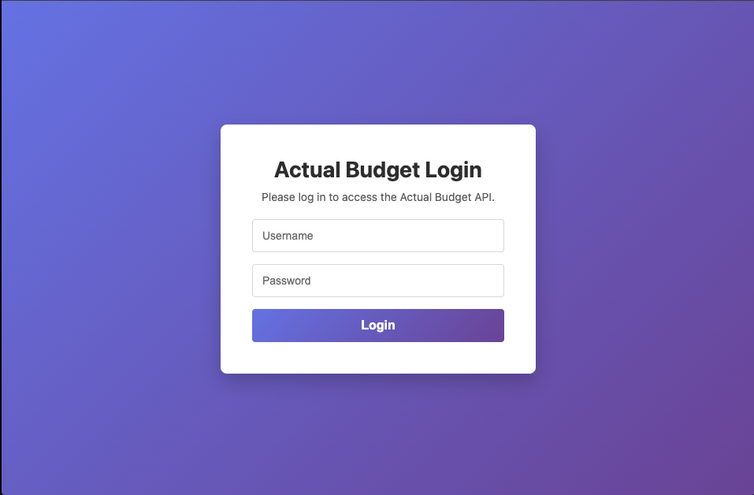
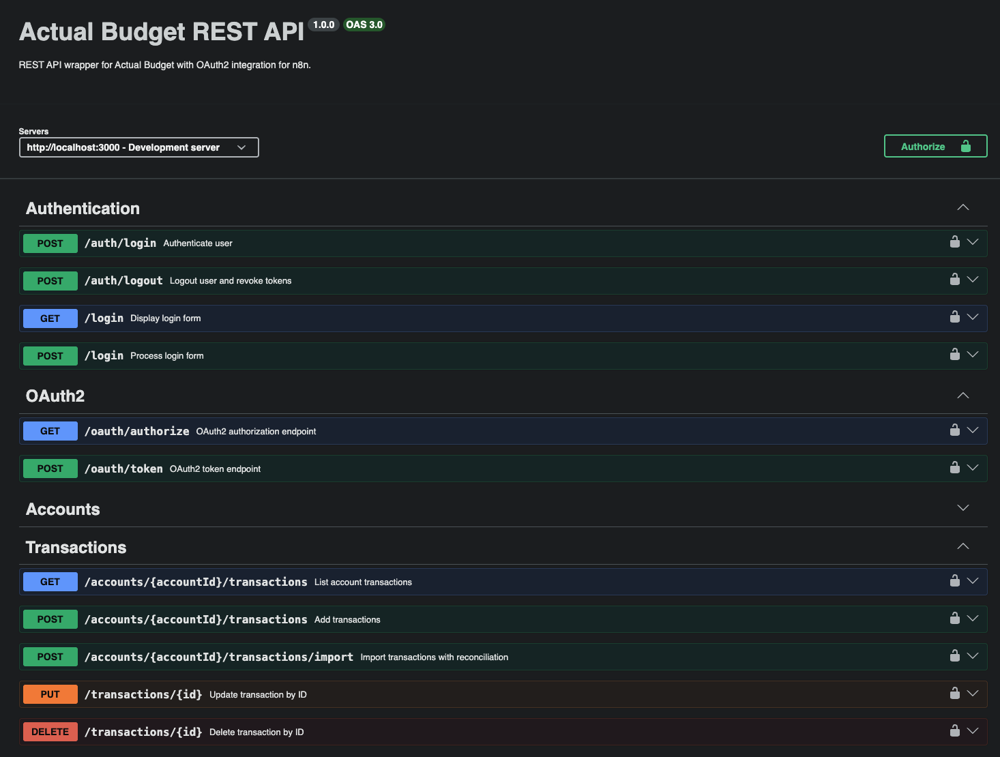
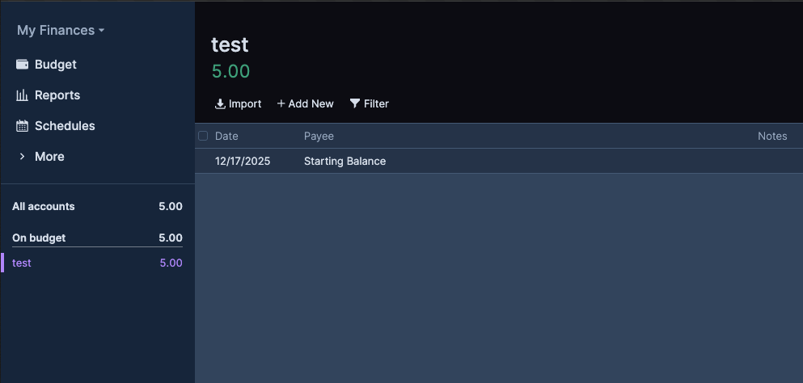

# Actual Budget REST API (Actual Budget API wrapper)

A secure Node.js/Express REST API that wraps the Actual Budget SDK (`@actual-app/api`). It provides JWT-based auth, optional OAuth2 for n8n, Swagger documentation, and a hardened runtime (helmet, CORS, structured logging, rate limits per route).





```
# Create an Account

## Get Token
TOKEN=$(
    curl http://localhost:3000/auth/login \
    -H "Content-Type: application/json" \
    -X POST \
    -d '{"username":"admin","password":"admin"}' \
    -s | jq -r '.access_token' \
)

## Get Accounts
curl http://localhost:3000/accounts \
-H "Authorization: Bearer $TOKEN"

## Create 'test' Account
curl http://localhost:3000/accounts \
-H "Authorization: Bearer $TOKEN" \
-H "Content-Type: application/json" \
-d '{"account":{"name":"test","offbudget":true,"closed":true},"initialBalance":500}'

## Get Accounts, showing 'test'
curl http://localhost:3000/accounts \
-H "Authorization: Bearer $TOKEN"
```



## Features
- Authentication: JWT access/refresh tokens, session login for docs
- Optional OAuth2: first-party flow for n8n (`/oauth/authorize`, `/oauth/token`)
- Endpoints: accounts, transactions, budgets, categories, payees, rules, schedules, query
- API Docs: protected Swagger UI at `/docs` with OpenAPI source in [src/docs/openapi.yml](src/docs/openapi.yml)
- Security: helmet headers, request IDs, SQLite token revocation, rate limiting, input validation
- Environment Validation: Automatic validation of all environment variables on startup
- Metrics: Built-in Prometheus metrics collection at `/metrics/prometheus` endpoint
- Monitoring: Pre-configured Prometheus and Grafana setup for real-time metrics visualization (see [monitoring/](monitoring/))
- Health Checks: Comprehensive health endpoint with database and API connectivity checks
- Redis Support: Optional Redis for distributed rate limiting (falls back to memory)
- Docker: production image + dev `docker compose` stack (Actual Server + n8n + Redis + Prometheus + Grafana)

## Requirements
- Node.js 22+ and npm
- Docker and Docker Compose (for recommended development workflow)
- Actual Budget Server credentials (or use the dev `docker compose` stack)
- For OAuth2 to n8n (optional): n8n instance and client credentials
- For production: dotenvx CLI and encrypted `.env` file with `DOTENV_PRIVATE_KEY`

## Installation & Setup

This section covers production deployment. For development setup, see the [Development](#development) section below.

### Prerequisites

1. **Clone the repository with submodules**:
   ```bash
   git clone --recurse-submodules https://github.com/your-username/actual-budget-rest-api.git
   cd actual-budget-rest-api
   ```
   
   **Important**: The `--recurse-submodules` flag is required because this project includes the `n8n-nodes-actual-budget-rest-api` as a git submodule. If you've already cloned without it, run:
   ```bash
   git submodule update --init --recursive
   ```

2. **Install dotenvx** (required for production):
   ```bash
   npm install -g dotenvx
   ```
   
   dotenvx is used to manage encrypted environment files in production. It provides secure encryption for sensitive configuration data.

3. **Docker and Docker Compose** (for containerized deployment):
   - Docker 20.10+ and Docker Compose 2.0+
   - Or use the production Docker image directly

### Minimum Environment Variables

Create a `.env` file with the following **minimum required variables** for production:

```bash
# Application environment
NODE_ENV=production

# Admin credentials
ADMIN_USER=admin
ADMIN_PASSWORD=YourSecurePassword123!  # Must meet complexity requirements (12+ chars, uppercase, lowercase, number, special char)

# JWT secrets (MUST be 32+ characters in production)
JWT_SECRET=your-jwt-secret-at-least-32-characters-long
JWT_REFRESH_SECRET=your-refresh-secret-different-from-jwt-secret
SESSION_SECRET=your-session-secret-different-from-jwt-secrets

# Actual Budget Server connection
ACTUAL_SERVER_URL=https://your-actual-server.com  # Your production Actual Server URL
ACTUAL_PASSWORD=your-actual-server-password
ACTUAL_SYNC_ID=your-budget-sync-id
```

**Generate secure secrets**:
```bash
# Generate secure secrets (32+ characters) - use different values for each!
openssl rand -base64 32  # For JWT_SECRET
openssl rand -base64 32  # For JWT_REFRESH_SECRET (must be different!)
openssl rand -base64 32  # For SESSION_SECRET (must be different!)
```

**Security Note**: In production, all secrets must be:
- At least 32 characters long
- Unique (never reuse the same secret for different purposes)
- Randomly generated (use `openssl rand -base64 32`)

See [.env.example](.env.example) for a complete list of all available environment variables with descriptions.

### Environment Management with dotenvx

This project uses **dotenvx** to encrypt environment files in production.

1. **Create and encrypt `.env`**:
   ```bash
   cp .env.example .env
   # Edit .env with production values
   dotenvx encrypt
   ```

2. **Or set variables individually**:
   ```bash
   dotenvx set ADMIN_PASSWORD "your-password"
   dotenvx set JWT_SECRET "your-secret"
   # ... set other variables
   dotenvx encrypt
   ```

3. **Store the private key securely**:
   - Extract from `.env.keys`: `grep DOTENV_PRIVATE_KEY .env.keys`
   - Store in your secrets manager (CI/CD, Kubernetes, etc.)
   - Never commit `.env.keys` to git

4. **Deploy**:
   ```bash
   export DOTENV_PRIVATE_KEY="$(grep DOTENV_PRIVATE_KEY .env.keys | cut -d '=' -f2 | tail -n1)"
   docker compose up -d --build
   ```

### Production Deployment

**Docker Compose with PostgreSQL** (recommended for production):
```bash
export DOTENV_PRIVATE_KEY="$(grep DOTENV_PRIVATE_KEY .env.keys | cut -d '=' -f2 | tail -n1)"
# Create .env.postgres file with: POSTGRES_USER, POSTGRES_PASSWORD, POSTGRES_DB
docker compose -f docker-compose.prod.postgres.yml up -d --build
```

**Docker Compose with SQLite** (simpler, single-container):
```bash
export DOTENV_PRIVATE_KEY="$(grep DOTENV_PRIVATE_KEY .env.keys | cut -d '=' -f2 | tail -n1)"
# Set DB_TYPE=sqlite in your .env file
docker compose -f docker-compose.prod.sqlite.yml up -d --build
```

**Docker Image**:
```bash
docker build -t actual-api-wrapper:latest .
docker run -d \
  --name actual-api-wrapper \
  -e DOTENV_PRIVATE_KEY="$DOTENV_PRIVATE_KEY" \
  -v $(pwd)/data/actual-api:/app/.actual-cache \
  -p 3000:3000 \
  actual-api-wrapper:latest
```

**Production Checklist**:
- ✅ Use HTTPS with reverse proxy (nginx, Traefik, etc.)
- ✅ Set `TRUST_PROXY=true` if behind reverse proxy
- ✅ Configure `ALLOWED_ORIGINS` with production domains
- ✅ Set `LOG_LEVEL=warn` or `error` for production
- ✅ Configure Redis for distributed rate limiting
- ✅ Set up monitoring (Prometheus/Grafana) - see [monitoring/](monitoring/)
- ✅ Regular backups of `DATA_DIR` volume
- ✅ For n8n: Use HTTPS callback URLs, configure OAuth2 credentials

## Development

### Quick Start (Docker - Recommended)

1. **Setup environment**:
   ```bash
   cp .env.example .env.local
   # Edit .env.local with your values (see below for minimum requirements)
   ```

2. **Start all services**:
   ```bash
   docker compose -f docker-compose.dev.yml up --build
   ```

3. **Configure Actual Server** (first run only):
   - Open http://localhost:5006 → Set password → Create/open budget
   - Get Sync ID from Settings → Advanced → Show Sync ID
   - Update `ACTUAL_PASSWORD` and `ACTUAL_SYNC_ID` in `.env.local`
   - Restart: `docker compose -f docker-compose.dev.yml restart actual-api-wrapper`

4. **Access services**:
   - API: http://localhost:3000
   - Actual Server: http://localhost:5006
   - n8n: http://localhost:5678
   - Grafana: http://localhost:3001 (admin/admin)
   - Prometheus: http://localhost:9090

**Minimum `.env.local` for development**:
```bash
ADMIN_USER=admin
ADMIN_PASSWORD=Password123!
JWT_SECRET=dev-secret-not-for-production
JWT_REFRESH_SECRET=dev-refresh-secret-not-for-production
ACTUAL_SERVER_URL=http://actual-server-dev:5006
ACTUAL_PASSWORD=<your-actual-server-password>
ACTUAL_SYNC_ID=<your-budget-sync-id>
```

**Note**: In development, missing secrets are auto-generated with warnings. Secrets can be shorter than production requirements.


### Monitoring

The dev stack includes Prometheus and Grafana. Access Grafana at http://localhost:3001 (admin/admin) → **Dashboards → Actual Budget REST API Metrics**.

The dashboard shows request rates, error rates, response times, and more. See [monitoring/README.md](monitoring/README.md) for configuration details.


## Environment Variables

All variables are validated on startup. Invalid or missing required variables cause the application to exit with clear error messages.

### Required (Production)
- `ADMIN_USER`: Admin username (default: `admin`)
- `ADMIN_PASSWORD`: Admin password (12+ chars, complexity required)
- `JWT_SECRET`: JWT signing key (32+ chars in production)
- `JWT_REFRESH_SECRET`: Refresh token key (32+ chars, different from `JWT_SECRET`)
- `SESSION_SECRET`: Session encryption key (32+ chars, different from JWT secrets)
- `ACTUAL_SERVER_URL`: Actual Budget Server URL
- `ACTUAL_PASSWORD`: Actual Budget Server password
- `ACTUAL_SYNC_ID`: Budget sync ID

### Optional
- `PORT`: Server port (default: `3000`)
- `NODE_ENV`: Environment mode (`development` | `production` | `test`)
- `JWT_ACCESS_TTL`: Access token TTL (default: `1h`)
- `JWT_REFRESH_TTL`: Refresh token TTL (default: `24h`)
- `ALLOWED_ORIGINS`: CORS origins (CSV, default: `http://localhost:3000,http://localhost:5678`)
- `TRUST_PROXY`: Trust proxy headers (default: `false`)
- `LOG_LEVEL`: Log level (default: `info`)
- `DATA_DIR`: Data directory (default: `/app/.actual-cache`)
- `REDIS_URL` / `REDIS_HOST` / `REDIS_PORT` / `REDIS_PASSWORD`: Redis connection
- `N8N_CLIENT_ID` / `N8N_CLIENT_SECRET` / `N8N_OAUTH2_CALLBACK_URL`: OAuth2 for n8n
- `ENABLE_CORS` / `ENABLE_HELMET` / `ENABLE_RATE_LIMITING`: Feature toggles (default: `true`)
- `MAX_REQUEST_SIZE`: Max request body size (default: `10kb`)

**Development Mode**: In `NODE_ENV=development`, secrets can be shorter and missing secrets are auto-generated with warnings.

See [.env.example](.env.example) for complete reference.

## API Docs & Validation
- OpenAPI source: [src/docs/openapi.yml](src/docs/openapi.yml)
- Local docs (auth required): GET `/docs`
- Validate OpenAPI:

```bash
npm run validate:openapi
```

## Auth Flows
- Local login (session for docs):
	- GET `/docs` → redirect to `/login`
	- POST `/login` → create session, then access `/docs`
- JWT login:
	- POST `/auth/login` with `{ "username": "admin", "password": "..." }`
	- Response contains `access_token`, `refresh_token`, `expires_in`
	- Send `Authorization: Bearer <access_token>` to protected routes
	- Rate limited: 5 requests per 15 minutes
- n8n OAuth2 (optional):
  - Configure env vars listed above
  - Endpoints available: `/oauth/authorize`, `/oauth/token`
  - Client secrets are hashed with bcrypt before storage
  - See [Connecting n8n](#connecting-n8n) for setup details.

## Query Endpoint

The `/query` endpoint allows executing ActualQL queries against Actual Budget data:
- **Security**: Table whitelist, filter depth limits, result size limits
- **Rate Limited**: 20 requests per minute
- **Audit Logging**: All queries logged with user ID and request context
- **Documentation**: See [ActualQL docs](https://actualbudget.org/docs/api/actual-ql/)

## Connecting n8n

### OAuth2 Flow (Recommended)

1. **Configure environment variables**:
   ```bash
   N8N_CLIENT_ID=example-n8n
   N8N_CLIENT_SECRET=<32+ character secret>
   N8N_OAUTH2_CALLBACK_URL=http://localhost:5678/rest/oauth2-credential/callback
   ```

2. **In n8n, create OAuth2 credential**:
   - Type: **OAuth2**
   - Authorization URL: `http://localhost:3000/oauth/authorize` (or your API URL)
   - Token URL: `http://actual-api-wrapper-dev:3000/oauth/token` (use Docker service name)
   - Client ID & Secret: Match your env vars
   - Redirect URL: Match `N8N_OAUTH2_CALLBACK_URL`

3. **Use in workflows**: Select the OAuth2 credential in HTTP request nodes.

**Benefits**: Automatic token refresh, no passwords stored, revocable tokens.

### Alternative: Bearer Token

For development, use JWT bearer tokens:
1. POST to `/auth/login` → Get `access_token`
2. In n8n HTTP node, set header: `Authorization: Bearer <token>`

**Note**: In production behind a reverse proxy, replace `localhost` and Docker hostnames with actual domains.

## CLI Commands

```bash
# Testing & Quality
npm test             # Run tests
npm run test:watch   # Run tests in watch mode
npm run test:coverage # Run tests with coverage
npm run lint         # Lint code
npm run audit        # Security audit
npm run validate:openapi  # Validate OpenAPI spec

# Docker Development
docker compose -f docker-compose.dev.yml up --build
docker compose -f docker-compose.dev.yml logs -f actual-api-wrapper
```

See [PRECOMMIT_SETUP.md](PRECOMMIT_SETUP.md) for pre-commit hooks setup.

## Data & Persistence
- SQLite auth DB: `${DATA_DIR}/auth.db` (persist the `DATA_DIR` volume)
- Actual SDK cache and budget data are managed by `@actual-app/api` using `DATA_DIR`
- Database migrations: Automatic schema migrations on startup (e.g., `client_secret_hashed` column)

## Observability

- **Logging**: Structured JSON logs (winston), respects `LOG_LEVEL`. Each request includes `X-Request-ID` for tracing.
- **Metrics**: Prometheus endpoint at `/metrics/prometheus`. Pre-configured Grafana dashboards in [monitoring/](monitoring/).
- **Health**: `/health` endpoint returns 200 (healthy) or 503 (degraded). Checks database, Actual API, and system resources.

## CI / Security
GitHub Actions run dependency and image security checks:
- npm audit, ESLint, Docker build test
- Snyk (requires `SNYK_TOKEN` secret)
- Container scan via Trivy (SARIF uploaded to code scanning)
- Secret scanning via Gitleaks
- OWASP Dependency-Check (SARIF upload)

Workflow tips:
- SARIF uploads require `permissions: { security-events: write, actions: read }`
- Forked PRs skip uploads to avoid permission errors

## Project Structure
- App: [src](src)
- Routes: [src/routes](src/routes)
- Auth: [src/auth](src/auth)
- Config: [src/config](src/config) - includes environment validation
- Docs: [src/docs](src/docs)
- Logging: [src/logging](src/logging)
- Errors: [src/errors](src/errors) - custom error classes
- Middleware: [src/middleware](src/middleware) - rate limiting, validation, metrics, etc.
- Tests: [tests](tests) - Jest test suite

## Documentation
- [ARCHITECTURE.md](ARCHITECTURE.md) - System architecture and design patterns
- [SECURITY.md](SECURITY.md) - Security model and threat analysis
- [.env.example](.env.example) - Complete environment variable reference
